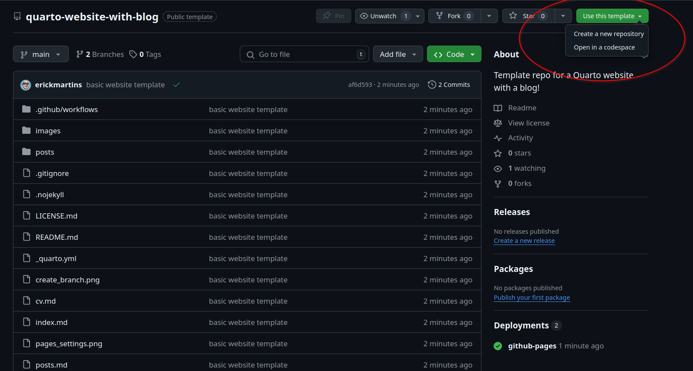
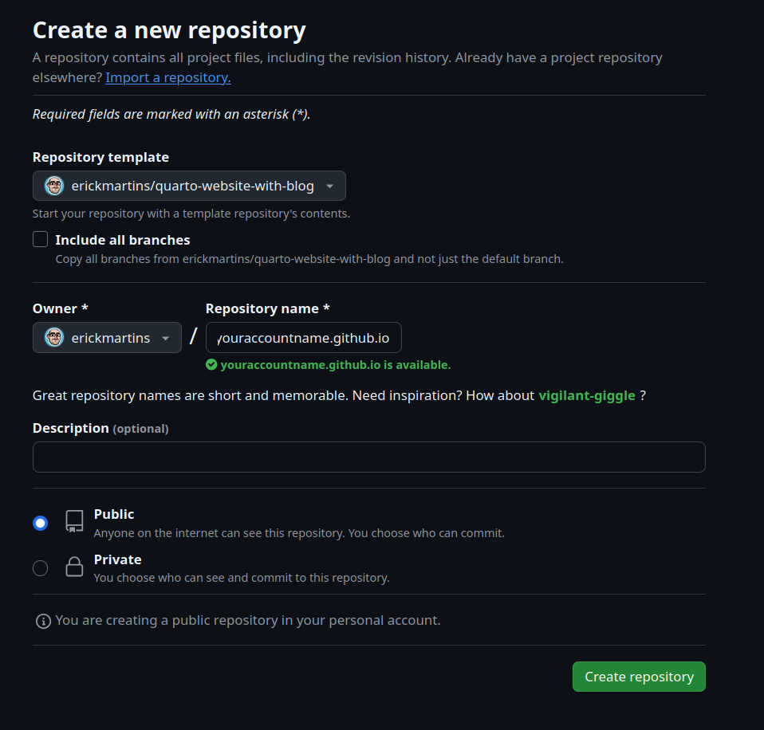
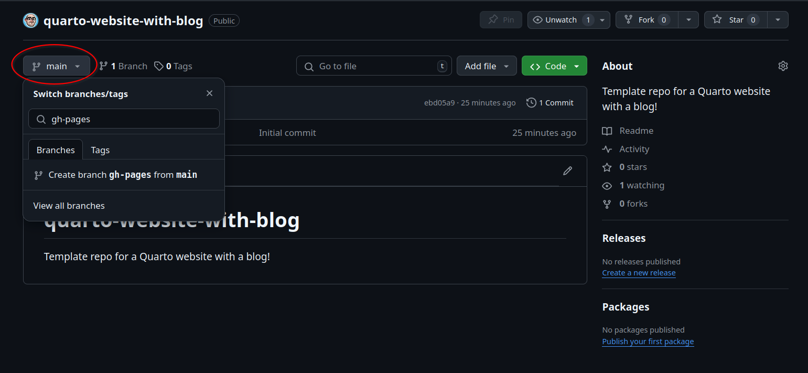
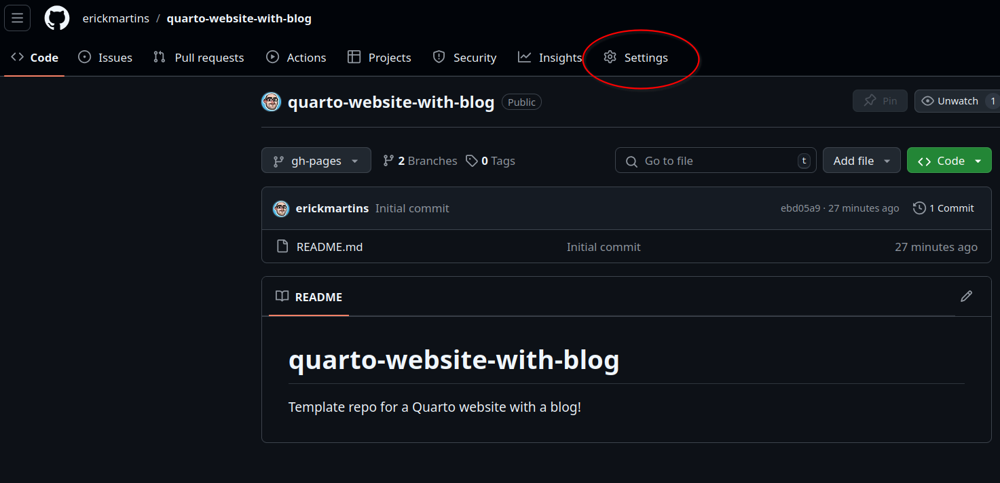
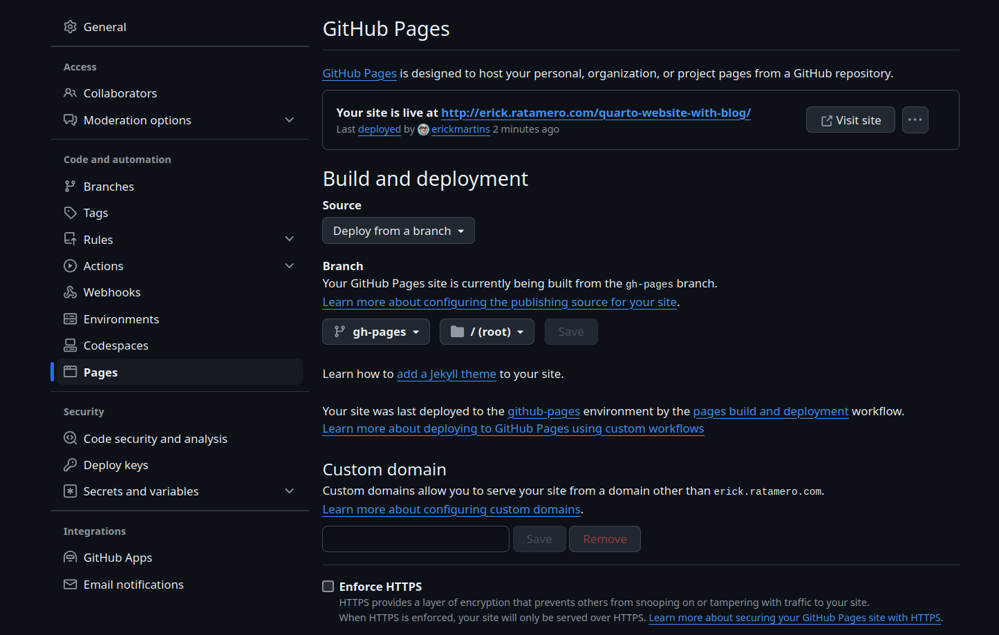

# quarto-website-with-blog
Template repo for a Quarto website with a blog!

## How do I use this?

First of all, you need to use this template to create a new repository into your own github account - on the top right, click "use this template", then "Create a new repository". 

Make it a repository named <YOUR_GITHUB_ACCOUNT>.github.io. You will need to make it public to be able to have it as a website, of course. Give it a description if you want.

There are two things you need to do in github: first, you need to create a `gh-pages` branch for your repository. Click on "main" on the top left of your repository's page, type `gh-pages`, click "Create branch gh-pages from main". Like this.

Next, you need to go into your repository settings. Here.

Now click on "Pages" on the left side and make sure "Source" says "Deploy from a branch" and "Branch" says "gh-pages", "root". Like this.

(If you want to use a custom domain, this is also where you set that up.)

With that done, go to work on your repository! Edit the `site_url` parameter in `_quarto.yml` to match your account name. Add your own picture, write your own content. Commit and push it to your repository. Everything else will happen automatically! The yml file inside `.github/workflows` creates an automatic action that renders your website from the markdown files. Your website will be visible and public at https://whateveryouraccountnameis.github.io as soon as you push any changes! (give it like a minute after a push to see any changes)

## Having to push to my repository every time I want to see what a change looks like is annoying.

I agree. If you want to work locally before pushing changes to your "live" website, you can do that! You will need to install [Quarto](https://quarto.org/docs/get-started/) locally for that. With quarto installed, just use your command-line program of choice to navigate to your local copy of your repository, and run `quarto preview`. Your browser should pop up with a working version of your website running from the local copy! Now you can change whatever you want, and everything will be re-rendered every time you save changes.

## Creating blog posts

For each new blog post you want to write, create a new folder inside `posts`. In there, create a markdown file named `index.md`. If you have images to be added to your post, just put them in the folder with the markdown file and reference them in the markdown (the post template I have in there shows how to do it!)
